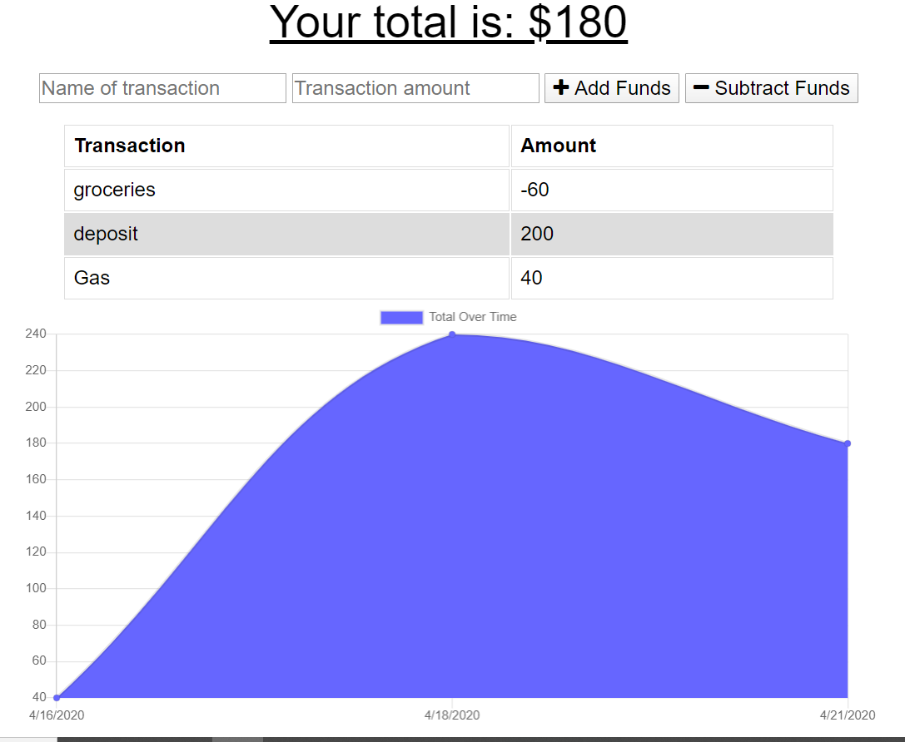

## Mission ##

As a user I want to be able to keep track and manage my expenses while being either online or off. 

## Progressive Budget Tracker ##

This application keeps track of deposits and spending either on or offline. The data is graphed so you know when and how your money is managed. 

## Deployment ##
https://wmbudget.herokuapp.com/

## What was used for this application ##

* Node.js
* Express
* MongoDB
* ServiceWorker
* Mongoose

## Screenshots ## 

